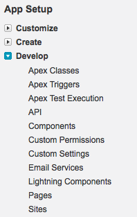

#Force.com Sites

Force.com sites allow external (public) facing websites to be created and hosted directly from your Salesforce instance. In this Quick Start you will create two Visualforce pages for external access - a home page and a links page - and set up a Force.com site to host the pages.

##Step 1 - Create the Home Visualforce Page
1. In your DE environment click **Your Name | Developer Console**
2. Select **File | New | Visualforce Page**
3. For the page name, enter **TrailheadHome** and click the **OK** button
4. In the body of the page (i.e. between the opening and closing `<apex:page>` tags), enter the following markup:
 
        <h1>Trailhead Site Home Page</h1>
        

            Welcome to the home page for the Force.com site 
            I have built in Trailhead.
        

        

            <a href="/TrailheadLinks">Click  here</a> to 
            visit the Links page.
        

        
5. Select **File | Save**

_Verification here that the page has been created and contains the "/TrailheadHome" anchor_

##Step 2 - Create the Links Visualforce page
1. In the Developer Console, select **File | New Visualforce Page**
2. For the page name, enter **TrailheadLinks** and click the **OK** button
3. In the body of the page (i.e. between the `<apex:page>` tags), enter the following markup:

        <h1>Trailhead Site Links Page</h1>
        

            Welcome to the Links page for the Force.com site I have built in Trailhead. 
            I hope the links below prove useful.
        

        <ul>
            <li><a target="_blank" href="https://developer.salesforce.com/trailhead">
                  Trailhead Home Page</a></li>
            <li><a target="_blank" href="https://developer.salesforce.com/forums">
                  Salesforce Developer Forums</a></li>
            <li><a target="_blank" href="http://www.salesforce.com/dreamforce/DF15/">
                  Dreamforce 15</a></li>
            <li><a href="/TrailheadHome">Back to the Home Page</a></li>
        </ul>

_Verification here that the page has been created and contains the "/TrailheadLinks" anchor_

##Step 3 - Create the Site
1. In your DE environment click **Your Name | Setup**
2. Locate the **App Setup** menu, expand the **Develop** submenu and select the **Sites** option

  

3. On the resulting page, enter the name of the Force.com domain for your site, check the box to indicate you have read and accepted the Terms of Use and click the **Register My Force.com Domain** button

  
  
4. When the domain is registered, the page is updated with a **Sites** section. 
  
    

5. Click the **New** button in the **Sites** section  
6. On the resulting, **Site Edit** page, enter **Trailhead** for the **Site Label** and **Site Name**  
6. Check the **Active** box  
7. Enter **TrailheadHome** for the **Active Site Home Page**  
8. Leave the other fields with their default values and click **Save**  

_not sure if the presence of a site can be checked via the Trailhead tools?_

##Step 4 - Add the Pages to the Site
When the site is saved, the Site Details page for the Trailhead site is displayed.

1. Scroll down to the **Site Visualforce Pages** section and click the **Edit** button 

  
  
2. On the resulting page, highlight the **TrailheadLinks** page in the **Available Visualforce Pages** list and click the **Add** button to move it to the **Enabled Visualforce Pages** list:

  

3. Click the **Save** button 

> Note that the **TrailheadHome** page is already present in the **Enabled Visualforce Pages** list, as it has been identified as the home page for the Force.com Site 

##Step 5 - View the Site
Once the available Visualforce pages have been saved, the **Site Details** page for the Trailhead site is displayed.

Scroll down to the **Custom URLs** section and click the **View** link in the **Action** column

This displays the site home page in a new browser window or tab.

Clicking the **Click Here** link navigates to the site links page, displaying useful links for accessing Trailhead and other resources

Copy the URL address of the site and open this in another browser that is not logged in to Force.com and you will see that the web site is available externally.
